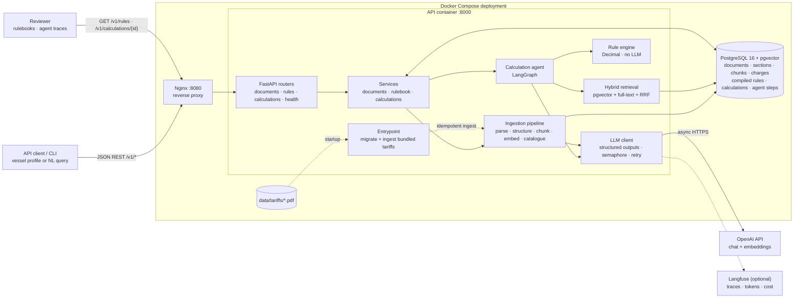
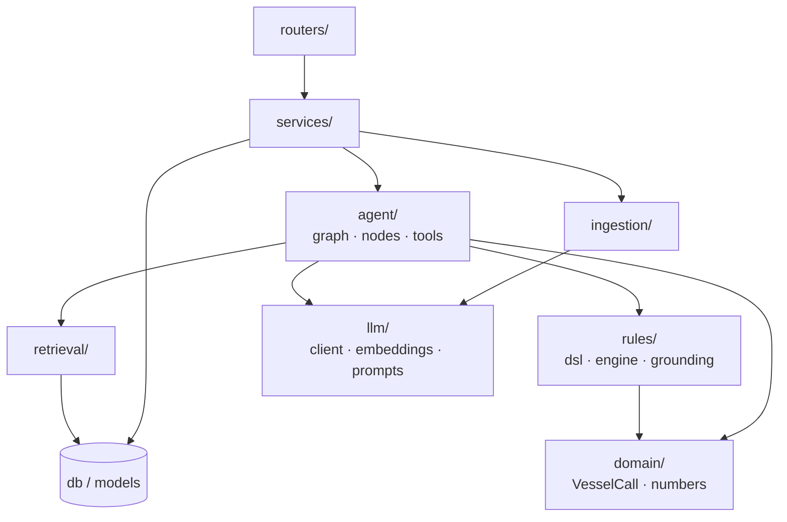
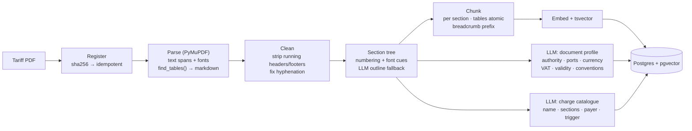
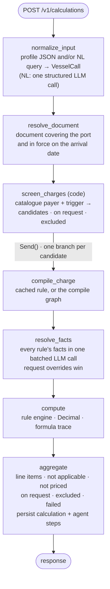
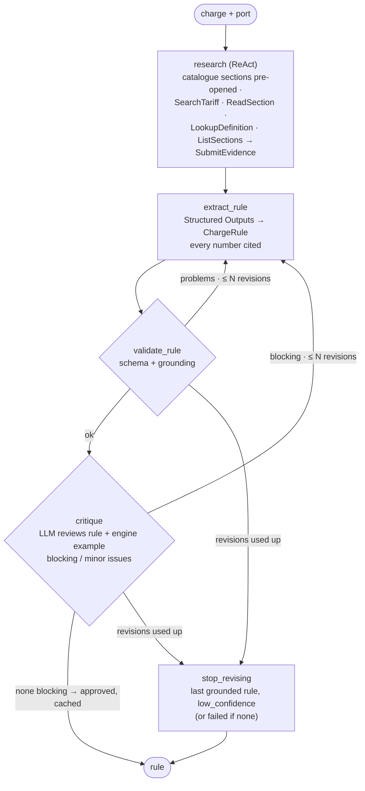
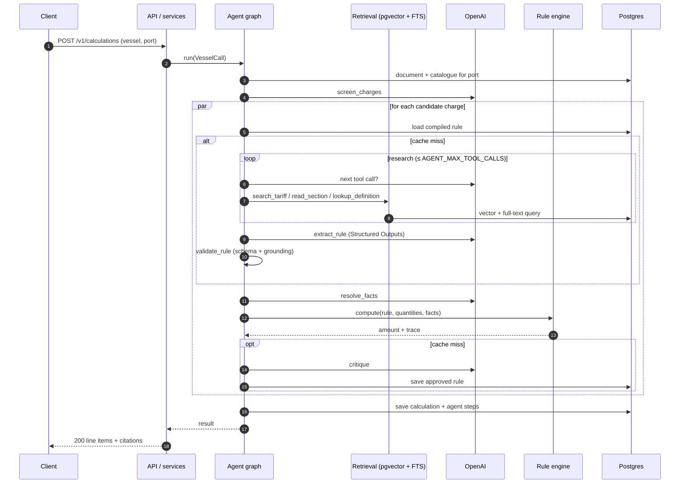
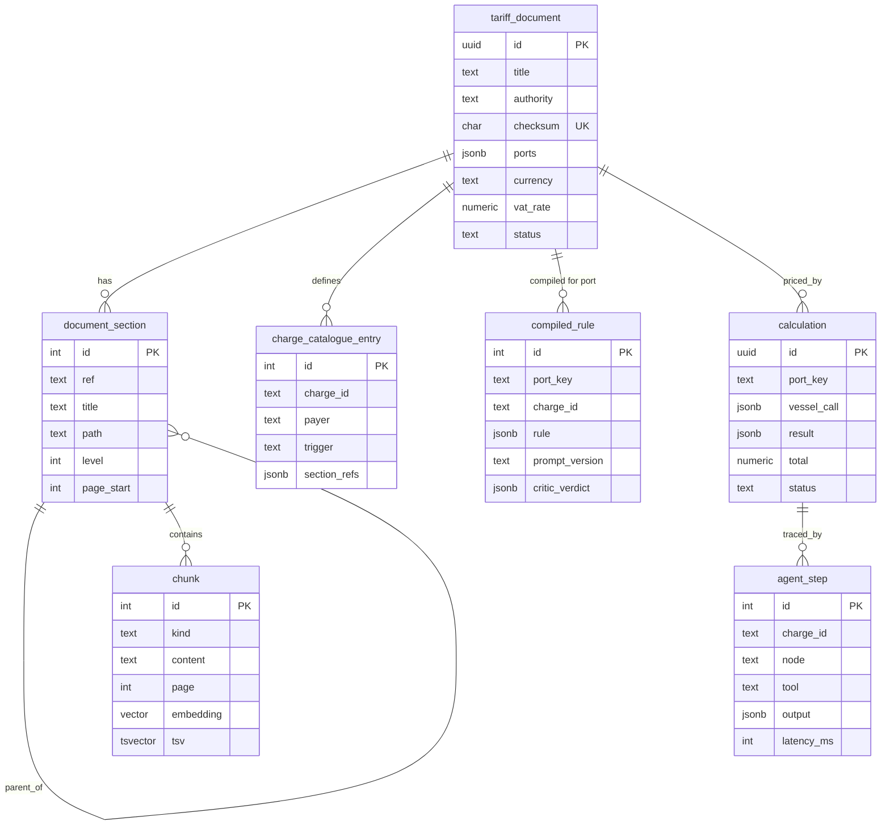

# Architecture

The guiding rule: **the LLM reads, the code calculates.** An agent finds and interprets tariff
rules in the document and writes them down as typed, cited data. A deterministic engine turns that
data into money. Nothing about any specific port or charge lives in the code.

## 1. System overview



Solid arrows show the request path; dotted arrows show startup work. Postgres is the only
datastore: pgvector for semantic search, a generated `tsvector` column for lexical search, and
JSONB for compiled rules and traces.

## 2. Module layering



`domain/` and `rules/` are pure Python, with no I/O and no LLM. They hold all of the arithmetic
and are the most heavily tested part of the system.

## 3. Ingestion: from PDF to a searchable, structured tariff



Two design points matter most:

- **Tables stay whole and keep their context.** A tariff table only makes sense together with its
  heading and the sentence that introduces it ("Per service based on vessel's tonnage:"), so each
  table chunk carries both. PyMuPDF's `find_tables()` keeps the port columns of the TNPA tables
  intact; plain text extraction scrambles them.
- **The charge catalogue is discovered, not configured.** One LLM pass over the outline lists every
  charge the document defines, who pays it, and what triggers it. That list drives the calculation,
  so a document with charges we've never seen (e.g. "waste reception fee", "ISPS dues") just works.

## 4. Calculation agent

Two LangGraph graphs. The calculation graph prices one vessel call; for every charge whose rule is
not yet cached it runs the compile graph, in parallel.



The compile graph, for one charge at one port (rendered by LangGraph from `app/agent/compile.py`):



Applicability lives in the rules, not in a screening call: a rule's `applies_when`, exemptions and
conditional components decide whether it charges this call, from the facts the batched
`resolve_facts` call decides (berth dues, for example, require a vessel that is not handling cargo).
A warm request with profile JSON therefore makes one LLM call. Rules flagged `low_confidence` are
priced and marked so (`confidence: low`, with the reviewer's open issues), never silently dropped.

### Why this is agentic RAG and not a fixed pipeline

- **Retrieval is driven by the agent.** In `research`, the model decides what to search for, which
  sections to open, and which definitions it needs (e.g. what "tonnage" means for this document)
  before it commits to a rule.
- **It checks its own work.** Grounding (code) and the critic (LLM) can send a rule back for
  re-extraction with concrete feedback.
- **The set of charges comes from the document.** Discovery and screening decide what to compute;
  the code has no list of charges.

## 5. One request, cold vs warm cache



## 6. Worked example: how the agent finds and prices towage at Durban

This shows what each step does with the real TNPA document. The numbers below appear in this doc
and in test fixtures only, never in `app/`.

1. **Discovery.** At ingestion, the catalogue lists `tugs_vessel_assistance` → §3.6, payer
   `vessel`, trigger `per_service`.
2. **Screening.** A bulk carrier entering and leaving Durban → `candidate`.
3. **Research.** `search_tariff("tug assistance fee per service vessel tonnage")` → the §3.6 table
   chunk ranks first. `read_section("3.6")` returns the craft allocation table, the fee table with
   one column per port, and the surcharge bullets. `lookup_definition("tonnage")` returns "gross
   tonnage as per the Tonnage Convention 1969". `read_section("3.1")` returns the ordinary working
   hours (Durban: 24 hours).
4. **Extraction.** Durban has its own column. The model emits a banded rule (abridged):

   ```json
   {
     "charge_id": "tugs_vessel_assistance",
     "name": "Tugs/vessel assistance and/or attendance",
     "section_refs": ["3.6"],
     "port_key": "Durban",
     "payer": "vessel",
     "status": "priced",
     "components": [{
       "kind": "banded", "id": "towage_fee", "label": "Fee per service by vessel tonnage",
       "basis": "gross_tonnage",
       "bands": [
         {"lower": "50001", "upper": "100000", "base_fee": "73118.07",
          "increment": {"rate": "32.24",
                        "units": {"basis": "gross_tonnage", "unit_size": "100",
                                  "rounding": "ceil", "above": "50000"}}},
         {"lower": "100000", "upper": null, "base_fee": "93548.13", "increment": {"…": "…"}}
       ]
     }],
     "multiplier": {"basis": "num_services", "unit_size": "1", "rounding": "ceil"},
     "adjustments": [
       {"id": "outside_hours", "kind": "surcharge", "description": "Outside ordinary working hours",
        "percent": "25", "applies_to": "all",
        "when": [{"fact": "service_outside_ordinary_working_hours", "op": "eq", "value": true}]}
     ],
     "facts": [{"name": "service_outside_ordinary_working_hours", "type": "bool",
                "description": "Service commences or terminates outside ordinary working hours (§3.1)",
                "default_value": false}],
     "notes": ["Fee is per service by tonnage band; the craft allocation table limits the number of tugs and is not a multiplier."]
   }
   ```

5. **Validation.** `73 118.07`, `32.24`, `50 000`, `100 000`, `93 548.13` and `25%` are all found in
   the cited chunks after normalisation, so the rule is grounded.
6. **Facts.** Quantities: `gross_tonnage = 51 300`, `num_services = 2` (assumption: one entering
   and one leaving movement). The surcharge fact resolves to `false`: §3.1 says Durban runs a
   24-hour service, so no service falls outside ordinary hours.
7. **Compute.** Band 50 000–100 000 → `ceil((51 300 − 50 000) / 100) = 13` → `13 × 32.24 = 419.12`
   → `73 118.07 + 419.12 = 73 537.19` per service → `× 2 = 147 074.38`.
8. **Critique.** Checks the column (Durban, not "other"), the band, the rounding, and that the fee
   is per service rather than per tug → `approved`, and the rule is cached for (TNPA 2024/25,
   Durban).

The next Durban calculation reuses the rule and goes straight to step 6.

## 7. Data model



## 8. How this meets the brief

| Brief asks for | Where it's handled |
|---|---|
| Consume a complex tariff PDF | Ingestion: section tree, atomic tables, hybrid index (§3) |
| Natural-language vessel query | `normalize_input` accepts NL, structured JSON, or both |
| All applicable charges | Charge catalogue + screening, with explicit `not_applicable` / `not_priced` / `excluded` lists |
| Accuracy | Deterministic `Decimal` engine, grounding checks, critic loop, golden-rule tests, live eval |
| Other ports and document updates without code changes | DSL of general tariff mechanics; rules compiled per (document checksum, port); synthetic-port eval; no-hardcoding guard test |
| Shows how the agent finds and interprets rules | Citations on every line item, an exportable rulebook, the `agent_step` trace, Langfuse spans |
| OpenAI models | All chat and embedding calls go through `langchain-openai` |
| Senior-level code | Layered modules, typed contracts, error taxonomy, resilience policy, offline tests |
| Bonus: API endpoint | FastAPI behind Nginx in Compose; public deployment with an API key (BUILD_PLAN §15) |
